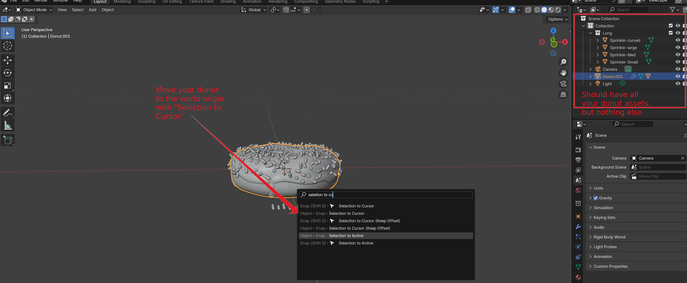
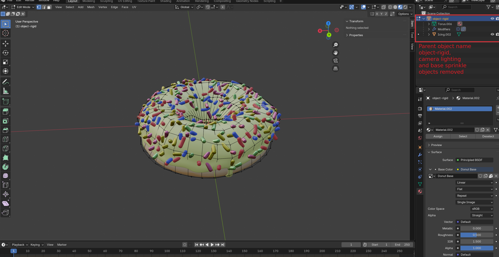

# donut-box

A Godot extension of the blender guru donut tutorial.

> "I want to use Blender to make assets for a game in Godot. I've followed the [Donut Tutorial](https://www.youtube.com/playlist?list=PLjEaoINr3zgEPv5y--4MKpciLaoQYZB1Z), now what?"

If you had this thought, you might find this project useful.

Disclaimer that at the time of writing this, I am a novice at both Blender and Godot. If you see a problem or have a suggestion for a better approach, feel free to open an issue.

# The Tutorial

This tutorial is aimed to get a sort of WYSIWYG export of a blender object directly in to a Godot project. I do not think it is the best practice to follow for something larger scale that needs maintainability, but is a helpful step to learning how godot works with blender. It may also be a simpler, more preferrable approach for development of smaller scale projects, like a game jam.

Detailed steps are below, the summarized tl;dr steps are:

1. Make a new blener file with *just* the donut (and sprinkle instances)
2. Delete camera and light
4. Fix normals in Blender
5. Realize instances with non-shader materials in blender
6. Toggle `Automatically Pack Resources` in Blender
7. Name your blender scene appropriately (`object-rigid`) for Godot's integration and this project's setup
8. Import the donut as a BlenderRigidBody (unique to this project)
8. Drag & Drop in to Godot and replace the whitebox donut

## 1: Starting with Blender

This project assumes that you have followed the [Blender Guru Donut Tutorial]((https://www.youtube.com/playlist?list=PLjEaoINr3zgEPv5y--4MKpciLaoQYZB1Z)).

I suggest you do the whole thing, but you could get away with any step after `Part 5: Shading`. Most of the problems this tutorial addresses will appear after `Part 8: Rendering`. Everything after `Part 10: Lighting` is irrelevant to this project.

All in all, you should have a `.blend` file with your whole donut scene (including all the parts of the scene that might be superflous to the godot project)

## 2: Importing to Godot

There are a lot of guides on how to do this. You can drag and drop, you can export to `.glb`, you can edit the file directly within the godot project space, etc.
I'm using "drag a `.blend` file from your filesystem in to the Godot interface"

### Problems

If you imported your blender scene, a few problems should be immediately apparent.

#### I don't want the whole Scene from blender!

You probably have a plate, a cup of cuttlery, a light, some sort of marble surface, etc...

But for this game, all you really need is the donut. There are two things you can do here:

1. In godot, when you import the scene: check "skip import" for all the assets you don't want.
2. In blender, select the Donut you want and copy it. Open a new blender project and paste the donut (and the sprinkle instances)

I suggest (2), otherwise things will get messy when solving the other problems. We'll still need to do (1) down the road for those sprinkles.

#### Why is the entire shape messed up?

This is one that some may run in to -- of the donut has a bunch of holes in it or otherwise just looks very strange compared to the source in blender, a decent guess is that your *normals* are wrong. You can fix this pretty easily in blender by selecting everything an "recalculate outside normals" (shift-N in Edit Mode).

#### Where are my Colors?

You might notice your donut has a little bit of color on the icing, but its patchy and *mostly* white. This has to do with how the Blender -> Godot pipeline handles *lighting* on the blender side.

In most cases, your game will be in charge of the lighting. You'll need to go in to Blender and delete the Light from the scene entirely. While you're there you might want to delete the camera as well -- all we really want is the donut itself.

Now if you import to godot, some of your colors should be working (in my case, only the material of the icing at this point)

#### Where are my Textures?

The icing is working now, but the donut itself is still white. And so are all the sprinkles.

The donut uses a texture, not a material or shader.

Textures are a *separate* file from the `.blend` file. If you're working in one big project with godot and blender assets together, this is *probably* fine. But for the limited scope of this tutorial, all we want to do is *take a blender object and drop it as-is in to godot*, without worrying about larger-scale project tooling.

You can *pack* a texture directly in to the `.blend` file, but that functionality is off by default. In *blender*, go to `File -> Export -> Automatically Pack Resources`, and make sure `Automatically Pack Resources` is checked. Save the blender project and add it to godot, and now your donut should have the texture you createad in part 5 of the blender guru tutorial.

You will notice now that the texture file you created in blender is also showing up in the godot project as a separate file.

#### What about the Sprinkles?

This is the most troublesome part bringing your donut in to godot -- the short answer is, because of the way the donut tutorial has you set this up, there really isn't a away to bring the sprinkles over as they are.

The sprinkles are using a Shader in blender, and blender shaders are simply not transferrable to godot (or anything other than blender, for that matter.) If you're going to use shaders you want to use them *in godot*.

There are a few paths you could take, the most straightforward are:

1. Bake the sprinkle shaders in to a texture, and pack that with the scene.
    - If you want to try this, I highly suggest you follow [Ryan King Art's Texture Map Baking Tutorial](https://www.youtube.com/watch?v=eE7FedDW2AI).
    - You will first need to "Make instances real" and "Make Object & Data Single User" for the sprinkles, after that its a matter of having the hardware to sample thousands of cycles
2. Re-implement the shader in Godot
3. Re-implement your sprinkles so that there's a real instance of every permutation (material x shape) and use that as the group for your geometry node, without using shaders at all.

This guide is going to explore option 3, mainly because it's the only approach I was able to actually implement. Steps are as follows:

1. "Duplicate objects" for all of your sprinkle shapes and move them so you can see them separately. Do this for every color variation in your shader.
2. For each cluster of sprinkles, create a new *material* and assign it the color, roughness, metallic, etc. settings your shader would apply.
3. Apply that material to every shape sprinkle in that cluster.
4. Repeat for every shader material output. I only had five colors and four shapes. So five clusters of sprinkles with four sprinkles in each.
5. Ensure all of those sprinkles have the right material applied (NOT the shader material from the tutorial), and are all in the same group (the one used by the geonode)
6. In geometry nodes, right before the end add "realize instances"
7. "Apply" the geommetry node so that it takes effect.
8. Delete the "source" sprinkles, we don't need them anymore.

Now you should have a donut with the materials for its sprinkles baked directly in to the model. If you import this in blender, the sprinkles should have the correct materials instead of being matte white.

**Setting up your sprinkle materials BEFORE applying geometry nodes**

**Applying Geometry Nodes**

#### Where is my Collision Mesh?

Dragging a `.blend` file from the filesystem browser in to your scene will give you an instance of the blend file's scene. This should at this point visually look right, but you'll notice that you're missing something important that the whitebox donut has: A collision shape.

If you try to replace the whole whitebox scene with your blender scene, you'll lose collision. If you try to replace the torus in the whitebox donut scene with your blender scene, it's incredibly unlikely that the existing torus collision shape (which was modeled directly against the torus mesh using godot's `Mesh -> Create Collision Shape` feature) will match your donut.

You could just resize the collision shape to more or less match your donut and call it a day, but that won't help you if decide you want something more complex than a slightly deformed but otherwise basic shape in your game.

You can tell Godot how to treat a mesh from Blender by appending a suffix to the mesh in the blender side. This is a Godot feature, [documentation can be found here](https://docs.godotengine.org/en/stable/tutorials/assets_pipeline/importing_3d_scenes/node_type_customization.html). For this tutorial, we want to treat the donut as a rigid body, so make sure that the blener scene name ends with `-rigid`.

You should now be in this sort of **final blender state**

## 3: Implementing The Game

You can clone the repository to get a nearly-working version of the game.

The game is simply a hollow 3D cube. Double-clicking will spawn a torus object (a "whitebox donut"), which you can fling around the cube.

In order to make use of your own, cooler donut, you will need to make a few changes.

### Importing the donut as a custom class

Godot will put all of your blender objects (including the rigid body) inside of a `Node3D` -- this means that you can't interact with the rigid body within very easily.

I [tried a few things](https://discord.com/channels/1235157165589794909/1343834207788470272) and have a somewhat satisfying solution: [a base class for exposing blender rigid bodies](https://github.com/Checkroth/donut-box/blob/main/scenes/rigid_blender.gd).
 To make use of it you must:

 1. Ensure the naming on the blender-side is consistent: your donut *must* be titled `object-rigid`. It is set up this way so that you could import any standalone object from blender and use the same helper class.
 2. In Godot, double-click the `.blend` file and ensure the `Root Type` is this project's custom class `RigidBlenderObject`, then re-import.

 

### Replacing the whitebox donut

1. Drop your `.blend` file in to the `donut.tscn` scene, and make sure its position is set to `0, 0, 0`.
2. Replace the reference to the whitebox donut in `donut.gd` with a reference to your blender donut.

That should be it! Under the hood there's a bit going on with collision shapes, raycasting, instantiating, and grouping. But the combination of the donut wrapper that holds an instance of the blender instance and the custom root type for the blender object itself should allow you to simply drop in & replace.

If you have difficulty, you might want to make sure the root and parent structure in blender is correct. The whitebox donut itself is structured in the exact way that your blender donut should be structured after importing to godot, and comparing that with reality could help you find potential issues at this step.

 ### Playing with materials

I personally think it would be more fun if the donuts bounced around a bit more. I intend to fill this section out with more details on how to mess with your imported objects to make them behave differently in the physics engine (make them more bouncy).

This section is a TODO, however.

# Attributions

- [Blender Guru's Donut Tutorial](https://www.youtube.com/playlist?list=PLjEaoINr3zgEPv5y--4MKpciLaoQYZB1Z)
- [Michael Jared's Blender-Godot Pipeline video on Geometry Nodes](https://www.youtube.com/watch?v=z0p-PTyaou8)
- [ALL THE WORK's Blender Geometry Node Export video](https://www.youtube.com/watch?v=qrXZNG4yAa8)
- [Kids Can Code's Camera Gimbal recipe](https://kidscancode.org/godot_recipes/4.x/3d/camera_gimbal/index.html) (for the game implementation)
- [Ryan King Art's Texture Map Baking Tutorial](https://www.youtube.com/watch?v=eE7FedDW2AI) (For translating sprinkle shaders to something we can drop in to godot easily)